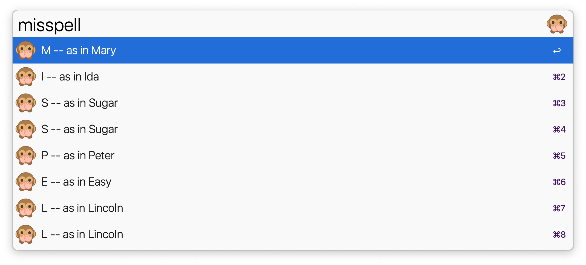

# alfred-phoneticSpelling 🙊
 An Alfred workflow for the phonetically challenged

<a href="https://github.com/giovannicoppola/alfred-phoneticSpelling/releases/latest/">
 
</a>

# Usage
- use a hotkey or a keyword (default: `!!s`)
- actioning one item will show spelling in large font
- shift+enter will open a custom dictionary (remember to leave at least one space between letter and word)

# Changelog
- 2023-10-04 version 1.2: support for umlaut, Swedish dictionary
- 2023-03-31 version 1.1: replaced default keyword (`!!s` instead of `spell`), better handling of custom.txt file